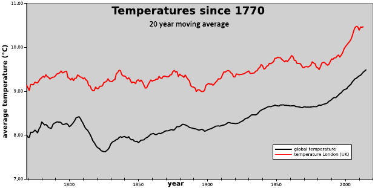
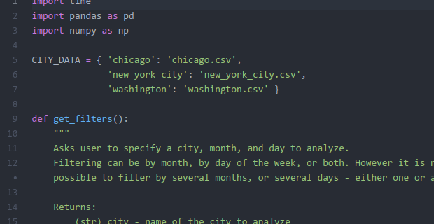
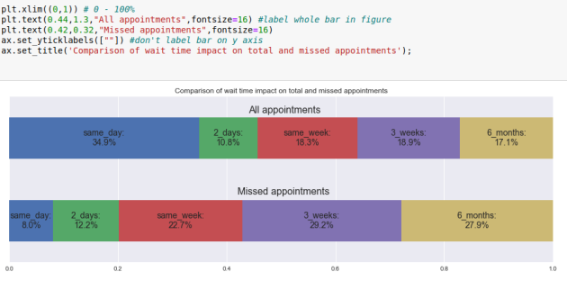
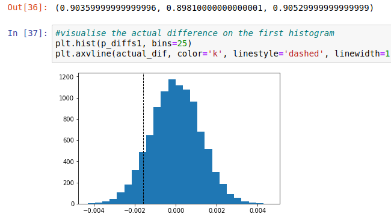
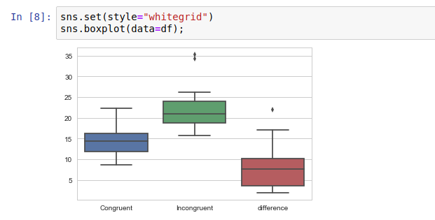
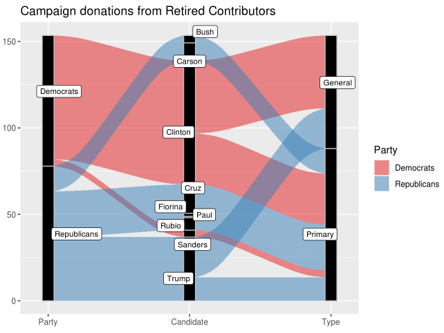
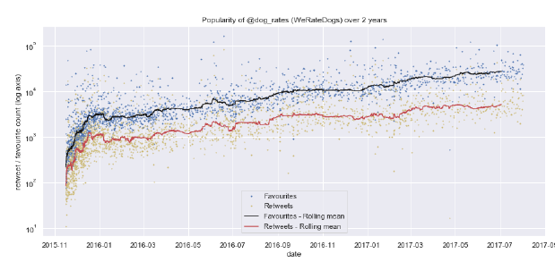
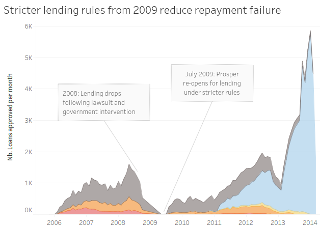

# Data Analyst Nanodegree Program

## Overview
Projects for Udacity Data Analyst Nanodegree Program (DAND)

|Term, Project, Topic|Project Description | Link |
| ------------------ |:---------------------:| :-------:|
|Term 1, Project 1 - *Welcome* |Brief introductory project using SQL and spreadsheet software to compare local with global temperature trends| [Explore Weather Trends](t1p1/termperature_trends.pdf)|
|Term 1, Project 2 - *Intro to Python* | Simple interactive script to calculate descriptive statistics on bike share data using Python 3, NumPy, and pandas | [Explore US bikeshare data](t1p2/README.md)|
|Term 1, Project 3 - *Intro to Data Analysis* | Investigation of a curated dataset with Python, Pandas in a Jupyter notebook| [Hospital No-show appointments](t1p3/dand-project-investigate-a-dataset_final.ipynb)|
|Term 1, Project 4 - *Practical statistics* | Analyse the results of an A/B test run by an e-commerce website| [Analyse A/B test](t1p4/Analyze_ab_test_results_notebook.ipynb)|
|Term 2, Project 1 - *Term Welcome* | Short introductory analysis of the Stroop effect| [Test A Perceptual Phenomenon](t2p1/Test_a_Perceptual_Phenomenon.ipynb)|
|Term 2, Project 2 - *Exploratory Data Analysis* |Performing a complete exploratory data analysis using R, using as dataset campaign contribution to the 2016 US presidential campaign | [EDA - 2016 US Campaign Finance](t2p2/dand_t2p2_campaign_finance.html)|
|Term 2, Project 3 - *Data Wrangling* |Gathering, cleaning, analysising data on thew WeRateDogs Twitter account| [WeRateDogs Twitter Data Wrangling](t2p3/README.md)|
|Term 2, Project 4 - *Data Story Telling*|Using Tableau | [Create a Tableau Story: Prosper P2P lending](t2p4/DAND_t2p4_report_Prosper.pdf)|

## Degree certificate

[Link](https://confirm.udacity.com/STRQEDGC) for the degree certificate 

# Projects details

## [t1p1] - Explore Weather Trends
This is a brief introductory project. The purpose is to compare local with global temperature trends using temperature data starting in the 18th century. The project involves using SQL and spreadsheet software 

#### screenshot

[Link to the Project - Explore Weather Trends](t1p1/termperature_trends.pdf)

## [t1p2] - Introduction to Python
The purpose of the project was to make use of Python to explore data fom Motivate, a bike share system provider, and compute a variety of descriptive statistics. The data related to bike share systems for three US cities : Chicago, New York City, and Washington. 

The aim was to calculate a few statistics and build a basic interactive environment where a user chooses the data and filter for a dataset to analyze.

#### files:
* DAND_project2_bikeshare.py: Python script
* chicago.csv, new_york_city.csv, washington.csv: data files

#### screenshot

[Direct link to the Project - Explore US bikeshare data](t1p2/README.md)

## [t1p3] - Introduction to Data Analysis
This module is aimed at learning about the data analysis process of questioning, wrangling, exploring, analyzing, and communicating data.

The project itself was to conduct data analysis on a dataset, answering a number of questions and create a file to share the findings. I learnt how to work with data in Python using libraries like NumPy and Pandas, as well as Pyplot and Seaborn .

I chose a dataset for analysis about medical appointments. This dataset collects information from 100k medical in Brazil and is focused on the question of whether or not patients show up for their appointment. A number of characteristics about the patient are included in each row. The project didn't include inferential statistics or machine learning, so these were tentative  findings.

#### files:
* dand-project-investigate-a-dataset_final.ipynb: Jupter notebook
* noshowappointments-kagglev2-may-2016.csv: dataset
* requirements.txt: libraries used (conda)
* readme_submission_notes.txt: submission notes

#### screenshot

[Direct link to the Project - Hospital No-show appointments](t1p3/dand-project-investigate-a-dataset_final.ipynb)|

## [t1p4] - Practical statistics
This module was about learning how to apply inferential statistics and probability to real-world scenarios.
The project was an analysis of results from an A/B Test run by an e-commerce website, aiming to help the company understand if they should implement the new page design or not. Approaches encompassed probability, a z-test and linear regression.

### files:
* Analyze_ab_test_results_notebook.ipynb: Jupyter notebook
* ab_data.csv, countries.csv: datasets

#### screenshot

[Direct Link to the Project notebook](t1p4/Analyze_ab_test_results_notebook.ipynb)

## [t2p1] - Second Term Intro
Short introductory project for the second term. The aim was to use a Jupyter notebook to compute descriptive statistics and perform a statistical test on a data set based on a psychological phenomenon, the Stroop Effect.

The project uses statistical analysis to evaluate the result from an experiment on the Stroop effect, a classic phenomenon from experimental psychology.

In psychology, the Stroop effect is a demonstration of interference in the reaction time of a task. When the name of a color (e.g., "blue", "green", or "red") is printed in a color which is not denoted by the name (i.e., the word "red" printed in blue ink instead of red ink), naming the color of the word takes longer and is more prone to errors than when the color of the ink matches the name of the color. The effect is named after John Ridley Stroop, who first published the effect in English in 1935. (Wikipedia)

### files:
* Test_a_Perceptual_Phenomenon.ipynb: Jupter notebook
* stroopdata.csv: datasets

#### screenshot

[Direct link to the Project notebook - Test A Perceptual Phenomenon](t2p1/Test_a_Perceptual_Phenomenon.ipynb)|

## [t2p2] - Exploratory Data Analysis
Performing a complete exploratory data analysis using R, using as dataset campaign contribution to the 2016 US presidential campaign 

[EDA - 2016 US Campaign Finance](t2p2/dand_t2p2_campaign_finance.html)|

## [t2p3] - Data Wrangling
Gathering, cleaning, analysing data on thew WeRateDogs Twitter account| [WeRateDogs Twitter Data Wrangling](t2p3/README.md)|

## [t2p4] - Data Story Telling
Using Tableau | [Create a Tableau Story: Prosper P2P lending](t2p4/DAND_t2p4_report_Prosper.pdf)|

https://public.tableau.com/profile/pierre.hentges#!/vizhome/ProsperStory_15544624601900/ProsperStoryver2

 
 
 
 
