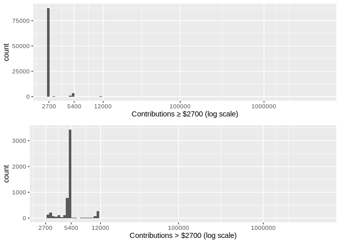

Analysis of US Campaign donations by Pierre Hentges
===================================================

> The dataset to be analysed is of campaign contributions to the US
> presidential elections from 2016. This includes donations in both the
> primary and general election campaigns, to candidates of all parties
> and across all US states.

> The dataset was downloaded from
> <a href="http://fec.gov" class="uri">http://fec.gov</a> and cleaned at
> the start, then saved as two .csv files (campaign2016data.csv,
> returned2016data.csv). Given the size of this data set -over 7 million
> records- most of the variables that will not be analysed have been
> removed. The cleaned data are submitted in the zip archive and are
> loaded in an early chunk of R code, while the two R chunks that clean
> the original file have been set to not run by default
> (“include=FALSE”).

Univariate Plots Section
========================

    ## [1] 7316484      10

The cleaned data set consists of 7.3 million contributions, with 10
variables. Let’s check them out more closely.

    ## 'data.frame':    7316484 obs. of  10 variables:
    ##  $ Candidate       : Factor w/ 25 levels "Bush, Jeb","Carson, Benjamin S.",..: 19 19 19 19 19 19 19 19 19 19 ...
    ##  $ Contributor_Name: chr  "OLSEN, GLENN" "OLSEN, GLENN" "JANELLI, REBECCA T." "ACCINELLI, THEODORA" ...
    ##  $ City            : Factor w/ 25106 levels ""," BATAVIA",..: 1830 1830 608 608 608 608 608 16811 6063 608 ...
    ##  $ State           : Factor w/ 50 levels "AK","AL","AR",..: 1 1 1 1 1 1 1 1 1 1 ...
    ##  $ Contribution    : num  100 110 100 50 200 100 100 382 250 50 ...
    ##  $ Date            : Date, format: "16-02-16" "16-02-24" ...
    ##  $ Election_Type   : Factor w/ 2 levels "General","Primary": 2 2 2 2 2 2 2 2 2 2 ...
    ##  $ Party           : Factor w/ 5 levels "Democrats","Green",..: 5 5 5 5 5 5 5 5 5 5 ...
    ##  $ CandidateSurname: Factor w/ 25 levels "Bush","Carson",..: 19 19 19 19 19 19 19 19 19 19 ...
    ##  $ Occupation      : Factor w/ 37 levels "Academic","Admin",..: 29 29 29 18 18 13 13 NA NA NA ...

    ##                      Candidate       Contributor_Name              City        
    ##  Clinton, Hillary Rodham  :3426975   Length:7316484     NEW YORK     : 206789  
    ##  Sanders, Bernard         :2040636   Class :character   LOS ANGELES  : 102623  
    ##  Trump, Donald J.         : 770038   Mode  :character   SAN FRANCISCO:  90829  
    ##  Cruz, Rafael Edward 'Ted': 556013                      BROOKLYN     :  87377  
    ##  Carson, Benjamin S.      : 247294                      SEATTLE      :  82318  
    ##  Rubio, Marco             : 103656                      (Other)      :6746545  
    ##  (Other)                  : 171872                      NA's         :      3  
    ##      State          Contribution          Date          Election_Type    
    ##  CA     :1302012   Min.   : -93308   Min.   :13-10-01   General:2584914  
    ##  NY     : 648529   1st Qu.:     15   1st Qu.:16-03-02   Primary:4731570  
    ##  TX     : 546776   Median :     28   Median :16-05-27                    
    ##  FL     : 424758   Mean   :    117   Mean   :16-05-19                    
    ##  MA     : 295317   3rd Qu.:     87   3rd Qu.:16-09-03                    
    ##  WA     : 291843   Max.   :4904861   Max.   :16-12-31                    
    ##  (Other):3807249                                                         
    ##          Party         CandidateSurname           Occupation     
    ##  Democrats  :5474694   Clinton:3426975   Retired       :1647814  
    ##  Green      :   8959   Sanders:2040636   Unemployed    : 644338  
    ##  Independent:   1231   Trump  : 770038   Info Witheld  : 314460  
    ##  Libertarian:  13274   Cruz   : 556013   Lawyer        : 240903  
    ##  Republicans:1818326   Carson : 247294   Senior manager: 230833  
    ##                        Rubio  : 103656   (Other)       :1802279  
    ##                        (Other): 171872   NA's          :2435857

-   many of the variables are categorical (or factorised), including the
    25 presidential candidates and their party, whether the contribution
    was made in the primaries or general election, information on the
    contributor (state, occupation)

-   the only numeric variable is Contribution amount, and the date of
    the contribution. These will be studied first.

-   the majority of contributions (4.7 million) were in the primaries,
    2.6 million for general election

-   Clinton and Sanders got a lot more contributions than Trump, also
    the Democrats got far more contributions than the Republicans

-   a number of variables (contributor name,address,employer,receipt
    comments etc) have been dropped as they won’t be analysed.

I’ll start by looking more closely at the Contributions variable. The
Contributions variable has a surprising range: from negative (-$93308)
to $4.904.861.

I’ll disregard the negative contributions for now and look at the
distribtion of positive contributions. The negative contributions have
been split off in a separate dataframe, to be analysed further down.
This dataframe which has additional columns that have been dropped from
the main dataframe for memory efficiency reasons.

    ##    Min. 1st Qu.  Median    Mean 3rd Qu.    Max. 
    ##       0      15      28     124      97 4904861

\*The interquartile range (IQR) of positive contributions is $72, and
varies between $15 to $87 - but range goes up to a maximum of $4.904.861
- it looks like there could be some outliers. Asymmetric shape is
suggested by the mean ($124) being much higher than the Median ($28).
histograms to look at the shape:

The campaign contribution data are extremely right-skewed: in a
histogram with 100 bins, 7 million donations are grouped in a single
bar. Using a logarithmic x scale: much of the data are now visible over
2 orders of magnitude, but extreme values are still not discernible.
Using logarithmic scales for both the x and y axes makes outliers
visible. The shape now approximates a symmetric distribution more. The
donations of several million $ are clearly outliers as they are 2 orders
of magnitude away from the rest of the data. One could argue that the
small number of donations below $0.10 could also be classified as
outliers since they are separated from the rest of the data.

To better understand the values at the very top and bottom percentiles I
will look more closely at these outliers.

    ##      0.01%       0.1%        95%        99%      99.9%     99.99%    99.999% 
    ##       0.80       1.00     400.00    2700.00    2700.00    5400.00   10800.00 
    ##   99.9999%       100% 
    ##   74135.61 4904860.51

It is noticeable how the top quantiles of 99.9% and 99.99% well below
$10K. Looking at quantiles, 0.1% to 99.9% corresponds to $1 - $2700 ;
and 0.01% to 99.99% corresponds to $0.80 - $5400. These may be related
to campaign finance legal limitations.

There are over 5,000 contributions of $1 but only few donations below
$1. Their usefulness for this study is questionable. As these take up 2
units on a log-scale x-axis if the full range is plotted, I will
consider removing them from the analysis.

Zooming in on the higher end, there are around 8,000 donations of
$2,700, and still some higher donations esp at $5,400, but very few that
are higher than $12,000. Next I’ll look at the individual contributions
above $20K.

    ##                       Candidate                  Contributor_Name Contribution
    ## 3205926 Clinton, Hillary Rodham HILLARY VICTORY FUND - UNITEMIZED    4904860.5
    ## 3250729 Clinton, Hillary Rodham HILLARY VICTORY FUND - UNITEMIZED    1797624.9
    ## 3253844 Clinton, Hillary Rodham HILLARY VICTORY FUND - UNITEMIZED    1603724.4
    ## 3256657 Clinton, Hillary Rodham HILLARY VICTORY FUND - UNITEMIZED    1467070.9
    ## 3286398 Clinton, Hillary Rodham HILLARY VICTORY FUND - UNITEMIZED    3686373.3
    ## 3291093 Clinton, Hillary Rodham HILLARY VICTORY FUND - UNITEMIZED    3600489.1
    ## 3301177 Clinton, Hillary Rodham HILLARY VICTORY FUND - UNITEMIZED    4575438.6
    ## 6827396        Trump, Donald J.                       BOCH, ERNIE      86936.8
    ## 7293177         Kasich, John R.               B&J DEVELOPMENT LLC      25000.0
    ## 7293179         Kasich, John R.        NAP INVESTORS HOLDINGS LLC      29100.0
    ##             Date Election_Type
    ## 3205926 16-03-31       Primary
    ## 3250729 15-12-31       Primary
    ## 3253844 15-12-04       Primary
    ## 3256657 16-01-31       Primary
    ## 3286398 16-02-29       Primary
    ## 3291093 16-04-29       Primary
    ## 3301177 16-05-31       Primary
    ## 6827396 15-08-28       Primary
    ## 7293177 15-12-30       Primary
    ## 7293179 15-12-30       Primary

There are 10 contributions above $20,000, all occurred in the primaries
campaign. 7 of these are from the “Hillary Victory Fund” and amount to
several million dollars each - these are clearly outliers. The remaining
contributions above $20,000 are in the 5 figure region, one to Trump and
two to Kasich, both occurring long before the primaries started.

Let’s look at the impact of the outliers on the mean:

    ## Summary statistics of (all positive) donations :

    ##    Min. 1st Qu.  Median    Mean 3rd Qu.    Max. 
    ##       0      15      28     124      97 4904861

    ## Summary statistics after removing Contributions > $1 million  :

    ##     Min.  1st Qu.   Median     Mean  3rd Qu.     Max. 
    ##     0.01    15.00    28.00   121.23    96.59 86936.80

Removing outliers above $1 million reduces the mean from $124 to $121 -
this is still far higher than the median of $28.

    ## Summary statistics after removing the top and bottom 0.01% of contributions:

    ##    Min. 1st Qu.  Median    Mean 3rd Qu.    Max. 
    ##     1.0    15.0    28.0   117.2    95.0  2700.0

Removing the top and bottom 0.01% quantile reduces the mean further to
$117.2 - still far higher than the median of $28. These observations
imply that, although the outliers of contributions above $1 million do
significantly raise the mean contribution, the distribution of the rest
of the contributions is still strongly right-skewed. In fact, the
strength of the right-skewness is consistent with the notion that the
contributions are log-normally distributed. To look into the issue of
whether the bulk of contributions (those between $1 and $2,700) is
log-normally distributed, I will look at their distribution further
using histograms with a log axis for the amount contributed:

Looking at the bulk of contributions between $1 and $2,700 shows the
discreteness of the donations variable - this is because contributors
don’t arbitrarily choose real numbers but rounded amounts such as $10,
$20 or $100 are far more common. However, the peaks of the common
contributions appears to follow a approximately normal distribution in
the plot above. The same can be said for bars representing less common
amounts. This discreteness can distract from the overall shape of the
distribution. For that reason I’ll study the shape of the distribution
further by reducing the number of bars in the histogram from 100 to 8 :

When donations between $1 and $2,700 are represented by a histogram with
8 bins and a logarithmic axis for the amount contributed, their
distribution comes close to a normal distribution - although they are
still slightly right-skewed.

In what follows, plots involving the variable of the amount contributed
will often use a logairthmic axis when the approximately log-normal
distribution matters.

This distribution relates to the *number* of contributions - but how
about the total sums raised? Small contributions are important but the
total sums raised are more important from the point of view of election
candidates that need to run an expensive campaign. To answer this
question, I want to compare the 8 bins in the histogram above to the
total raised in each of them.

In the two plots above, contributions are grouped into 8 bins by amount
contributed between $1 and $2,700, plus a 9th bar for all contributions
above $2700 (including outliers). The bin boundaries defining the 8
segments are set to fit on a logarithmic axis. The top plot displays the
number of contributions in each segment - effectively a histogram for
the first 8 segments - while the bottom plot displays the total income
campaigns receive from each of the segments (the sum of the contributed
amounts in each segment). (The actual figures represented in the two
plots are shown in the table below.)

Thus, while most common contributions are in the fourth segment (over 3
million contributions from $19.4 to $52, with a median of $27), raising
only just above $100 million, a much larger source of campaign income
-over $300million- is represented by around 125,000 contributions in the
8th segment of $1005 to $2,700 (median of $,2700). Noteworthy also that
the group of donations above $2700, with a median of $5400, is the
source of $51 million, (i.e. around half of the 3 million contributions
in the 4 segment) even though it comes from only 5390 contributions.

The two plots highlight the importance of distinguishing between the
distribution of the number of contributions and the amounts raised -
which are a reflection of the aproximately log-normal distrubtion of
contributions.

    ## # A tibble: 9 x 5
    ##   cuts                 count upper_bound        sum median
    ##   <fct>                <int>       <dbl>      <dbl>  <dbl>
    ## 1 [1,2.68]            100740        2.68    148886.      1
    ## 2 (2.68,7.21]         565780        7.2    2707353.      5
    ## 3 (7.21,19.4]        1321186       19.4   16228090.     10
    ## 4 (19.4,52]          3070772       52.0  105421504.     27
    ## 5 (52,140]           1202017      140.   112072946.    100
    ## 6 (140,375]           566342      374.   127367646.    250
    ## 7 (375,1.01e+03]      262382     1005    173604870.    500
    ## 8 (1.01e+03,2.7e+03]  125105     2700    308295215.   2700
    ## 9 <NA>                  5390  4904861.    51213475.   5400

Let’s come back to the negative contribution values - who donates
negative money to a campaign??

    ## [1] 94927    14

    ##      Min.   1st Qu.    Median      Mean   3rd Qu.      Max. 
    ## -93308.00   -275.00    -80.00   -466.86    -27.00     -0.01

There are around 95 thousand ‘negative contributions’. The median and
the mean are (in absolutely value) larger than the median an the mean of
positive donations studied above.

For comparison with the previous insights on distribution, I’ll look at
the distribution of contributions in the $1 - $2,700 range (using log
axis, and showing absolute values by multiplying by -1).

Negative contributions are skewed towards higher amounts, especially
those close to $2,700.

The original data contain a column for receipt descriptions. What are
the most common values of this variable?

    ## 
    ##                                Refund                                       
    ##                                 50370                                 25028 
    ##              REDESIGNATION TO GENERAL               REATTRIBUTION TO SPOUSE 
    ##                                 10142                                  4495 
    ##      REDESIGNATION TO CRUZ FOR SENATE REDESIGNATION TO PRESIDENTIAL GENERAL 
    ##                                  4426                                   246

“Negative” campaign contributions are typically contributions refunded
to donors, contributions redesignated to the another election
(e.g. general), or reattributed to the donor’s spouse.

Let’s look at the 5 number summary for those marked “Reattribution to
spouse”, “Refund”, and “redesignation to general” :

    ## REATTRIBUTION TO SPOUSE  :

    ##    Min. 1st Qu.  Median    Mean 3rd Qu.    Max. 
    ## -5400.0 -2300.0  -250.0  -976.4   -50.0    -1.0

    ## Refund  :

    ##      Min.   1st Qu.    Median      Mean   3rd Qu.      Max. 
    ## -93308.00   -270.00   -100.00   -423.65    -25.00     -0.01

    ## REDESIGNATION TO GENERAL  :

    ##    Min. 1st Qu.  Median    Mean 3rd Qu.    Max. 
    ## -2900.0 -2300.0  -250.0  -929.1   -50.0    -0.2

The median and interquartile range are really rather different from the
corresponding values for positive donations!

Are these returned donations used equally by all candidates?

Some categories of donations are used only by a few top republican
candidates, in particular Cruz.

The Refund category is mainly used by the two top Democratic candidates
Clinton and Sanders.

    ##                     Candidate  Contributor_Name receipt_desc memo_cd
    ## 7410      Carson, Benjamin S.         REID, SUE       Refund        
    ## 7411      Carson, Benjamin S.         REID, SUE       Refund        
    ## 35875 Clinton, Hillary Rodham GOCKE, THOMAS DR.       Refund        
    ## 69090        Sanders, Bernard      CARANGI, JOE       Refund        
    ## 78134        Trump, Donald J.      HYDE, ROBERT       Refund        
    ##             memo_text
    ## 7410                 
    ## 7411  REFUND REISSUED
    ## 35875                
    ## 69090                
    ## 78134

There are 5 refunded contributions above $15,000.

The shape of negative contributions differs from positive contributions,
i.e.  median and quartiles are much higher.

“Negative” contributions represent money returned to the donor either as
a refund, or part of being reassigned to a different purpose. While
these may not seem very interesting, they are commonly the outcome of
donors exceeding campaign limitations. However, negative values are
removed from the main dataset and will not studied further.

There are a lot of other variables in the data set which I will be
looking at to gain a better understanding of the data set. Many are
categorical, so often this is about looking at counts. First, let’s look
at election type and party.

The majority of contributions were made in the primaries, and only about
a third of were made in the general election.

The Democratic party received by far the largest number of contributions
- over twice as many as the Republican party. Contributions to third
party candidates are barely noticeable.

While most of the remaining variables are categorical, the date of
contributions can be usefully studied using histograms.

The histogram of when contributions were made shows a slow rise til
early 2016 - around February - when contributions reach a much higher
level. A peak is reached in the week of the election (8. November
2016.). Does this pattern correspond to primaries/general election?

Vertical lines indicate the start/end of primaries (top) as well as the
Republican convention (start of general election) and election day
(bottom). Contributions for the general election only really get going
once the primaries are over.

The histogram shows the number of donations per state, swing states are
in red. The number of contributions is elevated in California, New York
and Texas. This probably reflects the relative population size.

How about the different candidates? Bar charts of donations grouped by
party affiliation. First Republican candidates.

There are a lot of Republican candidates, and the number of donations to
them varies enormously. Some get a lot fewer donations to the extent
that they could be ignored for analysis, but there is no obvious cut-off
that could be used to distinguish between the ‘main’ vs ‘marginal’
candidates.

Next Democratic Party candidates, and, in one chart, third part
candidates, i.e.  Greens, Libertarians, Independents.

There are much fewer Democratic party candidates, and they clearly
separate into 2 main candidates - Clinton and Sanders - who attract
almost all the contributions, vs two candidates who get a neglegible
number of contributions. The number of contributions is far higher than
for Republicans, with Sanders receiving three times more than the top
Republican candidate, Trump.

As for third part candidates, the number of contributions they receive
is not in the same league as the two main parties. For the remainder,
analysis will focus on candidates from the two main parties.

Finally, data is available for the contributor occupation. However,
plaintext entry means that this is very inconsistent and had to be
extensively cleaned. However, only the 36 most common occupation
categories were used, plus “Info Witheld” category. Some of the
categories, such as “Retired”, “Homemaker” or “Disabled” are not jobs,
but define demographics whose political participation is interesting to
study as a group. For the remainder, this variable will contain NA:

    ##          Academic             Admin         Architect              Arts 
    ##            154502             58637             17204            112552 
    ##    Business owner      Construction        Consultant        Contractor 
    ##             80351              7093             80417             10480 
    ##          Disabled            Doctor            Driver       Electrician 
    ##             15612            165225              7646              7619 
    ##          Engineer            Farmer           Finance         Homemaker 
    ##             78704             17362            105565            108264 
    ##      Info Witheld            Lawyer         Librarian          Mechanic 
    ##            263465            239879             13789              3726 
    ##             Media             Nurse            Pastor        Pharmacist 
    ##             36862            100781              5390             12400 
    ##             Pilot     Programmer&IT      Psychologist       Real Estate 
    ##              8725             85715             39195             48973 
    ##           Retired Sales & marketing     Self-employed    Senior manager 
    ##           1629570             95088             61698            228385 
    ##     Social Worker           Student           Teacher      Truck driver 
    ##             22637             47130            171732             11275 
    ##        Unemployed              NA's 
    ##            643975           2423711

While data cleaning categorised a large majority of donors, for 2.4
million contributions, the descriptions were too low-quality to easily
categorise. Let’s compare the contributions for which there if
occupation information:

Contribution occupation is dominated by Retired people, as well as the
unemployed. To some extent, this is because these category are much
wider than particular job categories. More specific job categories are
dominated by white collar jobs, such as lawyers, academics, doctors.
Contributions with occupation “Info withheld” also stand out.

Univariate Analysis
===================

### What is the structure of your dataset?

The main dataset (campaign2016) contains information on 7.3
contributions to the 2016 US presidential election campaign. There are
11 variables with info on the amount contributed, the candidate it went
to, its date and if it was for the primaries or general election, the
donor’s name, location and occupation. This dataset was substantially
cleaned, a number of variables have been dropped because they are not
analysed here.

In order to drop variables relating to campaign receipt information,
negative contributions have been split off into a small separate
dataframe (returned2016) which still contains these variables, and which
is analysed briefly early on.

### What is/are the main feature(s) of interest in your dataset?

The campaign contribution amount is the key feature, as it expresses a
donor’s political support and an attempt to influence the election
outcome. To interpret this, one needs to study this variable’s
relationship to other key variables, such as which candidate/party the
contribution went to, who made the contributions, when they were made in
the campaign (primary/general, early/late).

### What other features in the dataset do you think will help support your 

investigation into your feature(s) of interest?

The key feature, the individual election contribution, could be thought
of as an individual vector whose size and direction is an expression of
political support. To properly investigate this key feature, one needs
to look at the origin (donor) and target of the vector
(candidate/party). One can also consider these vectors as being additive
in terms of demographics - aggregating the contributions of donors
sharing by occupation or geographical location can be interpreted as an
expression of collective political will.

An election campaign is a dynamic process that unfolds over time, and
which is shaped by external events as well as, for example, some
candidates exiting the race, the time when contributions were made is
important to make sense of what is happening.

Candidate party affiliation and election type (primaries/general) are
also crucial, as during the primaires stage, we’re effectively looking
at two separate races occuring in parallel, before the main “two-horse
race” of the general election campaign.

Another feature supporting the investigation is occupation: this enables
us to get an understanding of the different candidates’ social base.

There are further features that would be interesting to take into
consideration- in particular, the donor’s employer, and their
geographical location (ZIP). These could be used to study the effect of
wider economic intrests, as well as demographic effects (urban vs rural,
areas of deprivation, etc) using additional socio-economic data.
However, the work required is beyond the scope of the present study.

### Did you create any new variables from existing variables in the dataset?

Yes: the candidates’ party affiliation was not originally available, and
needed to be created as a variable.

The very low-quality occupation data was used to create a new variable
with 37 different categories.

Also, Candidate surname was created as the full-name often takes up too
much space in axis labels.

### Of the features you investigated, were there any unusual distributions?

Yes - intersting features of the contribution amount are the outliers,
the log-normal distribution, and the negative contributions.

The extreme outliers of contributions amounting to several million
dollars to the Clinton campaign in fact come from the Hillary Victory
Fund. These outliers - well beyond the normal contribution limitations -
in fact represent an aggregation of much smaller donations. However this
joint fund was controversial, with Sander’s alleging it aimed to “skirt
fundraising limits on \[Clinton’s\] presidential campaign”. (source:
<a href="https://en.wikipedia.org/wiki/Hillary_Victory_Fund" class="uri">https://en.wikipedia.org/wiki/Hillary_Victory_Fund</a>)

Looking at quantiles, the 99.9 percentile is $2700 ; while the 99.99
percentile is $5400. Interestingly these values correspond to legal
limits on contributions (donations limit for individuals and married
couples, respectively) and thus reflect how regulatory measures shape
how campaign finance works. (source:
<a href="https://transition.fec.gov/pages/brochures/citizens.shtml" class="uri">https://transition.fec.gov/pages/brochures/citizens.shtml</a>)

After removing outliers, and restricting the analysis to contributions
ranging from $1 to $2700, it became clear that its distribution
approximates a log-normal distribution (though this is still slightly
right-skewed). This distribution probably reflects the wealth
distribution in US society - which is also log-normal.

Finally, there are negative contributions whose distribution varies from
the rest of contributions. These contributions are often associated with
campaign finance limits. A common approach when a donation exceeds the
legal individual limit of $2,700 is to re-attribute the excess to a
donor’s spouse - which is then registered as a negative contribution.

### Did you perform any operations on the data to tidy, adjust, or change the form 

of the data? If so, why did you do this?

Yes, the low-quality occupation data was reduced and factorised to 37
different categories - though over 2 million contributions resisted this
data cleaning measure. This data cleaning measure simultaneously made
data analysis possible as well as reducing the memory footprint of this
variable.

Also, a number of records were dropped - those not relating to either
the primaries or general elections. “Negative donations” were split off
into a separate dataframe in which variables only relevant to the
analysis of negative donations were preserved.

Bivariate Plots Section
=======================

The variables investigated in this section : \* date vs election type
variables: comparison of the primaries and general election over time \*
candidate vs contribution amount variables: comparison of candidates of
the same party according to the contribution amount. Since only a single
candidate per party remains in the general election, the data are
restricted to donations in the primaries \* candidate vs date variables
: comparison of condidates in terms of when they received donations \*
party/candidate vs contribution amount: relative aggregated ontributions
and preference for one candidate over another

To compare primaries and general election over the contribution date, a
frequency polgon is a good way of comparing these, and using log y-axis
given the log-normal distribution of contributed amounts.

The (total) number of contributions per week continues to rise over the
course of the campaign. However there is a clear cross-over point when
the primaries finish. Interestingly, general election contributions do
occur during the primaries, and primaries contributions are recorded
during the general election campaign - the latter may be candidates that
are no longer in the race but still need to pay off expenses. During the
primaries, primaries contributions are around 2 orders of magnitude
(100fold) larger than those for the general election until the
cross-over point in August 2016.

What about the total amounts contributed during the primaries and
general election campaigns?

The sum of daily contributions follows a similar pattern as the number
of contributions in that there is a clear cross-over point in August
2016. However, the timeline for the sum of contirbutions is noisier as
it is daily rather than the weekly number of contributions shown in the
previous plot. The total amounts are likely also influenced by the time
points at which specific candidates leave the race. The visible spikes
are due to the outliers identified in the earlier section.

Now for a closer look at the primaries and what happens between
candidates. During the primaries, the race is between multiple
candidates of the same parties, unlike in the general election, when it
is between different parties. I will starting by looking at the
Democrats.

The mean contribution for each candidate is indicated by a cross. There
are quite substantial differences in the average donations for different
candidates, with Sanders and Clinton significantly lower median
contributions than the other democratic candidates. There are quite
prominent outliers for Clinton of several million dollars - these are
the outliers previously discussed. For Clinton, the mean contribution
(cross) is higher than the median - this is due to these outliers. In
comparison, for Lessig, the mean is lower than the mean, due to a number
of outliers at the low end.

To look more closely at the mean and five number summaryfor the two main
Democratic party candidates, here are the summary stats:

Clinton summary statistics:

    ##    Min. 1st Qu.  Median    Mean 3rd Qu.    Max. 
    ##       0      15      25     180     100 4904861

Sanders summary statistics:

    ##     Min.  1st Qu.   Median     Mean  3rd Qu.     Max. 
    ##     1.00    13.50    27.00    47.49    50.00 10000.00

At $180, the mean contribution in the primaries for Clinton is much
higher than for Sanders ($47.49). Is this entirely due to the outliers?
Here are the summary statistics for Clinton, with outliers removed by
only considering contributions up to $10.000 (the maximum for Sanders):

    ##    Min. 1st Qu.  Median    Mean 3rd Qu.    Max. 
    ##    0.01   15.00   25.00  162.41  100.00 7300.00

Removing the outliers lowers the mean contribution for Clinton in the
primaries to $162.41 - but this is still much higher than for Sanders,
even though the median amount contributed is relatively similar ($25 for
Clinton, $27 for Sanders). This means that, while the distribution of
contributions is right-skewed for both candidates, it is far more skewed
for Clinton, and on the basis of these numbers, the expectation is that
a higher proportion of contributions received by Clinton fall in the
higher categories.

To compare the distribution of contributed amounts between Clinton and
Sanders, we can plot a histogram of the contribution amounts (to compare
the dstributions for the two candidates, the amounts are normalised by
calculating the density, and only contributions between $1 and $10.000
are considered):

Amounts are plotted on a log-axis and 10 bins are used. Looking at these
“log-transformed deciles”, a higher proportion of the contributions to
the Sanders campaign fall in the 4th and 5th “log-decile”, while the
Clinton primary campaign receives a higher proportion of contributions
in the 6., 7., 8., 9. “log-decile”.

When did Democratic party candidates receive the most donations? We can
look at this using a frequency polygon of the number of donations
received each week. The vertical line marks the first primary contest on
February 1, 2016. While Lessig and Webb had suspended their campaigns
before the start of the first primary, O’Malley withdrew following 1.
February, after which Clinton and Sanders were the only 2 candidates
left in the contest. The second vertical line marks the final primary in
the District of Columbia on June 14. (source:
<a href="https://en.wikipedia.org/wiki/2016_Democratic_Party_presidential_primaries" class="uri">https://en.wikipedia.org/wiki/2016_Democratic_Party_presidential_primaries</a>)

Using a linear rather than a log axis, the contributions for any
candidates other than Clinton and Sanders are unnoticeable.

While Sanders’ contributions peaked in the middle of the primaries -
perhaps as a result of enthusiasm for Sanders ebbing as his chances of
winning the primaires waned, Clinton campaign contributions continued to
rise as the general election approached.

How does this relate to the total amount of contributions received?

Two things stand out here: (1) candidates other than Clinton and Sanders
are almost invisible ; (2) while Sanders receives far more contributions
than Clinton, Clinton receives more than twice as much money. In part
this is due to the fact that the “Hilary Clinton Victory fund”
aggregates numerous smaller donations. However, as point out above, even
if we exclude these, Clinton’s campaign contributions are much more
right-skewed as she receives more large donations than Sanders.

Let’s look at a new variable: donor occupation. Who are the people
donating money to the two main Democratic party candidates? Which are
the top 5 categories for each candidate? (totals in million dollars)

The difference betwen the two candidates is striking. While Retired
people and those who withold occupation info are to be expected to be in
the top 5 because they are the largest catgories overall, Sanders
receives far more money from unemployed people.

To some extent, this ranking will be determined by how occupation
categories were defined during the data cleaning step. To make this more
meaningful as a comparison between the support base of the two
candidates, I want to look at the number of contributions (to remove the
effect of some demographics having much higher disposable income) and at
the imbalance in which candidate is most preferred by donors of the same
occupation.

Self-employed donors are 80 times more likely to contribute money to
Sanders than to Clinton. Unemployed donors are over 20 times more likely
to contribute money to Sanders. Sanders is also much preferred by donors
in someblue-collor occupations - eletcricians, mechanics, truck drivers.

By comparison, those occupations which favour Clinton over Sanders only
express a milder bias of maximum 4 times.

Next for a similar analysis of Republican primaries.

There were 17 candidates from the Republican party. As it can be
difficult to visualise this many candidates in a plot, I will focus more
on the final 5 which remained in the race. What are the total amounts
received by each candidate’s campaign?

Contributions to the primary campaign of Cruz was significantly larger
than Trump, Rubio or Carson. However, it is important to note that we’re
only looking at registered contributions data, and billionaire candidate
such as Trump engaged in significant amount of self-financing ($66
million).

Also, with conribution totals ranging from around $10 to over $60
million for the top 5 Republican candidates, the primary campaigns of
the final 5 candidates received much less than the two final Democrat
candidates. (source:
<a href="https://www.opensecrets.org/pres16/candidate?id=N00023864" class="uri">https://www.opensecrets.org/pres16/candidate?id=N00023864</a>)

How much did the remaining Republican candidates receice?

Looking at the other Republican candidates, it is noticeable how much
less money they attracted in comparison to the two main Democratic party
candidates. Could it be that this is the result of the much larger
number of candidates? I.e. is the same amount of funding shared out
between a larger number of candidates?

The total amount of contributions received by Republican party
candidates was somewhat smaller - perhaps 1/5 - and shared between 17
different candidates. There are also less than half the number of
contribution to the Republican candidates in the primaries.

Now to continue with the analysis of the final 5 Repulican candidates
with a box plot.

The median contributed amount was highest for the Kasich and Rubio
campaigns. Trump received the lowest average (median) contributions of
the final 5 candidates - but also the highest outliers.

The start and the end of the primaries contests are shown by vertical
lines. Cruz and Kasich suspended their campaigns after the Indiana
primaries on 3.May (middle line), after which Trump remained as the sole
candidate. Carson withdrew on 4.March, Rubio on 15. March.

(source:
<a href="https://en.wikipedia.org/wiki/2016_Republican_Party_presidential_primaries" class="uri">https://en.wikipedia.org/wiki/2016_Republican_Party_presidential_primaries</a>)

Surprisingly perhaps, Trump received the vast majority of primary
contributions after the end of the primaries. This is quite different
from the other candidates who received the bulk of contributions during
their primary campaign.

Compared to the Democrats, the two main Republican candidates have a
more similar donor base.

Again, compared to the Democrats, the preferences for either of the two
top Republican candidates are less pronounced.

Now I want to analyse the general election campaign using similar plots.
First let’s look at the general election campaign donations of the
different candidates.

Perhaps surprisingly given observations for the primaries, Clinton
received the lowest mean and median contributions of all the candidates
in the general election campaign. Third party candidates and Trump were
similar.

    ##    Min. 1st Qu.  Median    Mean 3rd Qu.    Max. 
    ##    0.01   15.00   25.00  101.97   75.00 5400.00

    ##     Min.  1st Qu.   Median     Mean  3rd Qu.     Max. 
    ##     0.80    40.00    89.05   223.77   250.00 10000.00

Across all quartiles, general election contributions received by Trump
are much higher than those received by Clinton - with the mean being
over twice as high for Trump.

Does this disparity in the contribution amount extend to the number of
contributions?

Vertical lines show the start and end of the general election campaigns.

Looking at the number of weekly contributions, the Clinton campaign is
consistently and overwhelmingly more popular during the general election
campaign.

Bivariate Analysis
==================

### Talk about some of the relationships you observed in this part of the 

investigation. How did the feature(s) of interest vary with other
features in  
the dataset?

It’s important to distinguish between the number of contributions and
the summed amount as these are often at odds. For example, while Sanders
received far more contributions in the primaries, the the toal sum
raised by Clinton is far higher.  
Similarly, while Democratic Party candidates received over wice as many
donations than Republicna party candidates in the primaries, the sums
raised are much closer together. What this observation means is that
some candidates and parties are preferred by donors making large
contributions.

Another interesting observation is that the total sums raised in the
primaries by the main Republican candidates is significantly smaller
those of the main Democratic candidates, probably because the number of
Republican candidates was much larger. Plausibly, the total amount of
finance that can potentially be raised in each party’s primaries is
limited, so a larger number of candidates has this effect.

### Did you observe any interesting relationships between the other features 

(not the main feature(s) of interest)?

Analaysis of the contribution date reveals some interesting
relationships: while most candidates in the primaries received the bulk
of donations during the primaries contest as well as in the runup to the
primaries, Trump received the majority of primaries donations after the
primaries had finished.

As for the date of donations to the general election campaign, while the
stream of donations to Clinton increased throughout the period of the
general election, donations to the Trump general election peaked early
on in the general election campaign, and then were at a relatively low
level.

### What was the strongest relationship you found?

Comparing the support base of Clinton and Sanders using the occupation
variable was instructive: some demographics had a very strong preference
in who they donated to. In particular self-employed and unemployed
donors were 80 times and over 20 times more likely to donate to Sanders.
This may be indicative of Sanders mobilising different demographics.

Multivariate Plots Section
==========================

The first relationship I want to get a better overview of is a
comparison of candidates during the primaries race in terms of the
relative density distribution of contributions over time - i.e. the
variables of candidate, date, number of contributions restricted by
election type.

In order to do this and capture how the primary race within a party
unfolds, I will use violin plots to look at when candidates received
most of the contributions. In volin plots, the relative density of
contributions is visualised, i.e. contributions are normalised for each
candidate. These will use Date as the x-variable, with Candidate as the
third ctegorical variable, restricted to the primary election campaigns.

The violin plot shows the distribution in time of all of a campaign’s
contributions, with the date on the horizontal axis.

Webb and Lessig received most contributions long before the primaries
started. O’Malley received the bulk of contributions before 1. February,
and while they markedly declined after he withdrew from the race,
contributions continued for several months. It is not unusual to still
receive donations after a candidate withdraws from the race: “In US
elections, suspending a campaign allows candidates to cease active
campaigning while still legally raising funds to pay off their debts” -
source:
<a href="https://en.wikipedia.org/wiki/2016_Democratic_Party_presidential_primaries" class="uri">https://en.wikipedia.org/wiki/2016_Democratic_Party_presidential_primaries</a>

The evolution of contributions is relatively different for the other two
candidates. Sanders campaign contributions peaked in May, while for the
Clinton primary campaign, the number of contributions kept increasing
until the end of the primaries.

Here is the equivalent violin plot for the top 5 Republican candidates:

The start and the end of the primaries contests are shown by vertical
lines. Cruz and Kasich suspended their campaigns after the Indiana
primaries on 3.May (middle line), after which Trump remained as the sole
candidate.

Surprisingly perhaps, Trump received the vast majority of primary
contributions after the end of the primaries. This is quite different
from the other candidates who received the bulk of contributions during
their primary campaign. Also noticeable how much earlier Rubio started
to receive campaign funding. Carson withdrew on 4.March, Rubio on 15.
March.

Below is the correpsonding violon plot for the two main candidates in
the general election:

The previous analysis looked at the occupations of supporters of the
different candidates, however this was limited by the number of
occupation categories that could be investigated, and the metric (number
of donations vs sums raised). Treemaps are an excellent multivariate
type of plot to get a more complete understanding of different
candidates’ support base. In the plots below, the size of rectangles is
an expression of the number of contributions, with the colour hue
encoding the median contribution donated by people with the same
occupation.

First a treemap of the relative support bases of Clinton and Sanders
during the primaries.

While the occupations that most strongly support Sanders - the
unemployed, programmers- differ from Clinton, many of the remaining
groups are quite similar. However there are some drastic differences in
the total of contributions - for example lawyers and senior managers
donate far more money to Clinton. It is also intersting that the group
with the highest median donations is people witholding information on
their occupation.

How about support for the top Republican candidates in the primaries?

The support base for the four top Republican canidates is relatively
similar, with Retired people playing a large role. Some patterns are
discernible - business owners prefer Trump, homemakers prefer Cruz- but
there doesn’t seem to be a particular demographic being mobilised
unexpectedly (as can be seen with Sanders and unemployed donors)

Let’s use the same analysis to compare Trump and clinton in the general
election:

3 things stand out: (1) Clinton receives significantly more money during
the general election (2) while some groups are shared, others have an
aversion to Trump - e.g. teachers, academics, the unemployed, those
working in the arts ; (3) groups that donate to both candidates donate
much higher amounts to Trump - senior managers, doctors, lawyers.

Alluvial diagrams are another multivariate plot suitable to gaining
insight into the multifaceted flows of campaign finance. Below is an
alluvial diagram of contributions coming from retired donors (in million
$).

    ## Warning: The parameter `label.strata` is deprecated.
    ## Pass arguments to `infer.label` instead.

Retired donors contribute a large amount of campaign finance to both of
the main parties. The majority of it is donated in the primaries.
Sanders received far less money from retired contributors than Clinton.
Trump was the main recipient for Republican candidates, but Clinton
received significantly more than Trump, in both the primaries and the
general election.

Another demographic mentioned before are the unemployed. Which
candidates did they donate their money to?

    ## Warning: The parameter `label.strata` is deprecated.
    ## Pass arguments to `infer.label` instead.

In comparison the the retired, unemployed donors contributed a lot less
- just over $30 million - but they gave almost all of it to the
Democrats. They had an extreme preference for Sanders - which is why
almost all of their contributions were made in the primaries.

Multivariate Analysis
=====================

### Talk about some of the relationships you observed in this part of the 

investigation. Were there features that strengthened each other in terms
of  
looking at your feature(s) of interest?

The two alluvial diagrams show striking differences in the patterns of
campaign donations by two large an important groups of donors: the
retired and the unemployed. While the support from retired donors
reflects general trends seen in the analysis, unemployed donors shunned
all Republican candidates and, also largely Clinton, to give very strong
financial support to Sanders.

The treemap comparing the supporters of the Clinton and Trump general
election campaigns reveals some interesting aspects. While Clinton
receives significantly more money during the general election, the
median donations by occupation to Trump are much higher for a lot of
occupations. Also, while some groups are shared, others have an aversion
to Trump - e.g. teachers, academics, the unemployed, those working in
the arts. Also, groups that prominently donate to both candidates, such
as senior managers, doctors, lawyers, donate much higher amounts to
Trump.

### Were there any interesting or surprising interactions between features?

The violon plots are a good way to compare the dynamic of the Democratic
and Republican primaries races: after the other candidates left, the
Democratic primaries became a “two-horse race” between Sanders and
Clinton quite early on ; by comparisons, the 17 Republican candidates
dropped out more gradually, leading to a more crowded field for much of
the context.

------------------------------------------------------------------------

Final Plots and Summary
=======================

### Plot One

### Description One

The top plot is a histogram representing donations in the range between
$1 and $2,700 into 8 bins (plus an extra bin for donations above
$2,700), while the bottom plot visualises the corresponding aggregate
sums raised. The disparity between the amount raised in the lower bins
and the higher bins is stark. The first 4 bins raise around $100
million, but a much larger source of campaign income -over $300million-
is represented by around 125,000 contributions in the 8th segment of
$1005 to $2,700.

This disparity is linked to the log-normal distribution of
contributions. It expresses an important truth about campaign finance:
size of donations matters. The amount of political influence that is
obtained through campaign finance falls dispropotionately on the
relatively small number of people who can afford to donate large
amounts.

### Plot Two

### Description Two

This plot shows the race between top candidates in the Republican
primaries as it unfolds. The violin plots show the density of
contributions over time (normalised to be the same for all candidates).
Vertical lines show the beginning and the end of the primaries, as well
as the point from which Trump becomes the sole remaining candidate,
after Cruz and Kasich suspended their campaigns following the Indiana
primaries on 3.May.

Rubio started to receive campaign donations since March 2014, receives
the bulk of finance around the early part of the primaries - and exits
after a month, on 15. March. Carson - who received a higher proportion
of funding in the 6 months in the run up to the primaries start - leaves
the race on 4. March.

By contrast Trump - who partially self-funded his campaign to the tune
of $66 million - received the vast majority of primary contributions
after the end of the primaries.

### Plot Three

    ## Warning: The parameter `label.strata` is deprecated.
    ## Pass arguments to `infer.label` instead.

### Description Three

This alluvial diagram shows what is perhaps the strongest relationship
revealed in this analysis: donors who are unemployed show strong support
for Sanders specifically. Of the $30 million they donate, almost nothing
goes to Republican candidates, and perhaps 1/10 to Clinton. Similarly
the majority of contributions are in the primaries: after Sanders leaves
the race, they lose almost all interest in supporting the Democrats
financially. ——

Reflection
==========

Really interesting to learn some new types of plots like treemaps and
alluvial diagrams. Also interesting to analyse in more depth the
distribution of contribution amounts and the reason behind ‘negative
contributions’.

Cleaning the donor occupation data was more work than I had anticipated
but once it was done it made the analysis pretty interesting.
Frustratingly, a lot of the data remains un-analysed.

Perhaps it may seem questionable to choose the whole dataset of the 2016
election campaign, rather than only data for a single state. My original
plan had been to also use the ZIP codes to map donors geographically,
and combine this with information such as deprivation, unemployment,
ethnic diversity, rural vs urban character. Trump (and to some extent
Sanders) have been portrayed as ‘disruptors’ of the normal rules of US
elections - it would have been very intersting to look for evidence of
them mobilising particular demographics in particular areas, perhaps
attempt to build a predictive model for donors in which neighbourhoods
unexpectedly support a particular candidate. Unfortunately the amount of
work required turned out to be beyond the scope of this project.

### References

the following is a list of Web sites used in creating my submission

<a href="https://transition.fec.gov/pages/brochures/citizens.shtml" class="uri">https://transition.fec.gov/pages/brochures/citizens.shtml</a>
<a href="http://fec.gov/disclosurep/pnational.do&amp;sa=D&amp;ust=1548605508118000" class="uri">http://fec.gov/disclosurep/pnational.do&amp;sa=D&amp;ust=1548605508118000</a>
<a href="https://www.opensecrets.org/pres16/candidate?id=N00023864" class="uri">https://www.opensecrets.org/pres16/candidate?id=N00023864</a>
<a href="https://en.wikipedia.org/wiki/Hillary_Victory_Fund" class="uri">https://en.wikipedia.org/wiki/Hillary_Victory_Fund</a>)
<a href="https://en.wikipedia.org/wiki/2016_Democratic_Party_presidential_primaries" class="uri">https://en.wikipedia.org/wiki/2016_Democratic_Party_presidential_primaries</a>)
<a href="https://en.wikipedia.org/wiki/2016_Republican_Party_presidential_primaries" class="uri">https://en.wikipedia.org/wiki/2016_Republican_Party_presidential_primaries</a>)
<a href="https://en.wikipedia.org/wiki/Swing_state" class="uri">https://en.wikipedia.org/wiki/Swing_state</a>
<a href="https://stackoverflow.com/a/47210732" class="uri">https://stackoverflow.com/a/47210732</a>
<a href="https://github.com/datasciencedojo/DataMiningFEC/blob/master/6%20Bucketing%20Occupation%20Groups.R" class="uri">https://github.com/datasciencedojo/DataMiningFEC/blob/master/6%20Bucketing%20Occupation%20Groups.R</a>
<a href="https://gist.github.com/jennybc/6f3fa527b915b920fdd5" class="uri">https://gist.github.com/jennybc/6f3fa527b915b920fdd5</a>
<a href="https://stackoverflow.com/a/31925893" class="uri">https://stackoverflow.com/a/31925893</a>
<a href="https://stackoverflow.com/a/53448372" class="uri">https://stackoverflow.com/a/53448372</a>
<a href="https://stackoverflow.com/a/17374663" class="uri">https://stackoverflow.com/a/17374663</a>
<a href="https://stackoverflow.com/a/51147233" class="uri">https://stackoverflow.com/a/51147233</a>
<a href="https://stackoverflow.com/a/42237896" class="uri">https://stackoverflow.com/a/42237896</a>
<a href="https://stackoverflow.com/a/45820586" class="uri">https://stackoverflow.com/a/45820586</a>
<a href="https://stackoverflow.com/a/22181949" class="uri">https://stackoverflow.com/a/22181949</a>
<a href="https://ggplot2.tidyverse.org/reference/geom_bar.html" class="uri">https://ggplot2.tidyverse.org/reference/geom_bar.html</a>
<a href="https://stackoverflow.com/a/6901597" class="uri">https://stackoverflow.com/a/6901597</a>
